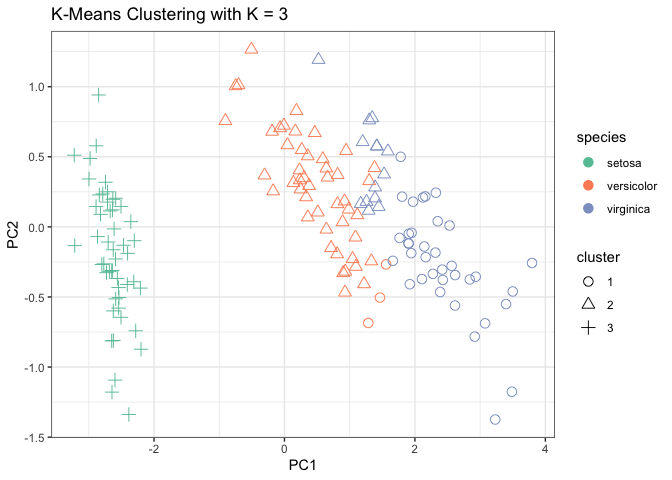

#### Introduction

The Iris dataset consists of 150 observations of iris flowers, each has
four attributes: Sepal.Length, Sepal.Width, Petal.Length, and
Petal.Width. There are three different species of iris in the dataset.
The goal of this tutorial is to implement a Shiny R app that allows the
user to cluster the samples based on the four attributes, and to
visualize the results.

#### Load the required libraries:

    library(shiny)
    library(ggplot2)
    library(tidyverse)
    library(magrittr)
    library(knitr)

#### preparing the data

load the data

    data("iris")

Then we would extract the attributes to perform K-means clustering

    df <- iris[,-5] # excluding the Species column
    species <- iris$Species

Run PCA to reduce dimensionality

    pca <- prcomp(df)

#### Performing K-means clustering

the custermized function for K-means clustering

    kmeans_clustering <- function(df, K) {
            # Fit the k-means model
            clustering_fit <- kmeans(df, centers = K)
            
            # Cluster assignments
            cluster_assignments <- clustering_fit$cluster
            
            return(list(cluster_assignments, clustering_fit))
    }

### the UI layour

    # UI
    ui <- fluidPage(
            titlePanel("K-Means Clustering of the Iris dataset"),
            
            fluidRow(
                    #selecting number of clusters
                    column(2,numericInput("K", "Number of Clusters", 
                                          value = 4, min = 1, max = 9,
                                          step = 1)),
                    #clustering assignment displayed in plot
                    column(9,plotOutput("plot"))
            ),
            fluidRow(column(3,tableOutput("table1")),
                     column(7,tableOutput("table2"))
            ),
            
            hr(),
            print("by Zixuan Yu   Feb 8th,2023") # add the footer
            
    )

### The server components

We would use **K=3** to plot an sample scatter plot in this tutorial,
but the final R Shiny App would allow user to change the value of K
(from 1 to 9).

#### the scatter plot

    K = 3
    cluster_results <- kmeans_clustering(pca$x[, 1:2], K)
    # in the server function, you would need to wrap the right side with reactive ({ })

    ggplot(data.frame(pca$x[, 1:2]), 
           aes(x = PC1, y = PC2, 
               color = species, # color by species
               shape = factor(cluster_results[[1]]))) +
                    #shape representing cluster assignment
            geom_point(size = 3, show.legend=TRUE) + 
            scale_color_brewer(type = "qual", palette = "Set2") + 
            # change color palette
            scale_shape_manual("cluster",values = c(1:K))+
            ggtitle( paste("K-Means Clustering with K =", K))+
            theme_bw()

#### Table1 showing how many species in each cluster

     df_res <- iris # make a copy of the original data used 
    df_res$cluster = cluster_results[[1]] # add cluster assignment to df_res
                    df_res %>%
                            group_by(cluster,Species) %>% 
                            tally() %>%
            kable()

<table>
<thead>
<tr class="header">
<th style="text-align: right;">cluster</th>
<th style="text-align: left;">Species</th>
<th style="text-align: right;">n</th>
</tr>
</thead>
<tbody>
<tr class="odd">
<td style="text-align: right;">1</td>
<td style="text-align: left;">versicolor</td>
<td style="text-align: right;">3</td>
</tr>
<tr class="even">
<td style="text-align: right;">1</td>
<td style="text-align: left;">virginica</td>
<td style="text-align: right;">36</td>
</tr>
<tr class="odd">
<td style="text-align: right;">2</td>
<td style="text-align: left;">versicolor</td>
<td style="text-align: right;">47</td>
</tr>
<tr class="even">
<td style="text-align: right;">2</td>
<td style="text-align: left;">virginica</td>
<td style="text-align: right;">14</td>
</tr>
<tr class="odd">
<td style="text-align: right;">3</td>
<td style="text-align: left;">setosa</td>
<td style="text-align: right;">50</td>
</tr>
</tbody>
</table>

#### Table2 showing the summary statistics of each cluster

    df_res %>% group_by(cluster) %>%
                            summarise(n = n(),
                                    avg.Sepal.Length = mean(Sepal.Length),
                                    avg.Sepal.Width = mean(Sepal.Width),
                                    avg.Petal.Length = mean(Petal.Length),
                                    avg.Petal.Width = mean(Petal.Width)) %>%
            kable()

<table>
<thead>
<tr class="header">
<th style="text-align: right;">cluster</th>
<th style="text-align: right;">n</th>
<th style="text-align: right;">avg.Sepal.Length</th>
<th style="text-align: right;">avg.Sepal.Width</th>
<th style="text-align: right;">avg.Petal.Length</th>
<th style="text-align: right;">avg.Petal.Width</th>
</tr>
</thead>
<tbody>
<tr class="odd">
<td style="text-align: right;">1</td>
<td style="text-align: right;">39</td>
<td style="text-align: right;">6.853846</td>
<td style="text-align: right;">3.076923</td>
<td style="text-align: right;">5.715385</td>
<td style="text-align: right;">2.053846</td>
</tr>
<tr class="even">
<td style="text-align: right;">2</td>
<td style="text-align: right;">61</td>
<td style="text-align: right;">5.883607</td>
<td style="text-align: right;">2.740984</td>
<td style="text-align: right;">4.388525</td>
<td style="text-align: right;">1.434426</td>
</tr>
<tr class="odd">
<td style="text-align: right;">3</td>
<td style="text-align: right;">50</td>
<td style="text-align: right;">5.006000</td>
<td style="text-align: right;">3.428000</td>
<td style="text-align: right;">1.462000</td>
<td style="text-align: right;">0.246000</td>
</tr>
</tbody>
</table>

#### Put the them together! The following chunk is an demonstration of the server function

    # Server
    server <- function(input, output) {
            # Cluster the data
            cluster_results <- reactive({
                    kmeans_clustering(pca$x[, 1:2], input$K)
            })
            
            # Plot the results
            output$plot <- renderPlot({
                    # use PCA result to plot (for the purpose of dimensional reduction)
                    ggplot(data.frame(pca$x[, 1:2]), aes(x = PC1, y = PC2, 
                                                         color = species, 
                                                            # color by species
                                                         shape = factor(cluster_results()[[1]]))) + 
                                                            # shape representing cluster assignment
                            geom_point(size = 3, show.legend=TRUE) + 
                            scale_color_brewer(type = "qual", palette = "Set2") + 
                                    # change color palette
                            scale_shape_manual("cluster",values = c(1:input$K))+
                            ggtitle( paste("K-Means Clustering with K =", input$K))+
                            theme_bw()
            })
            
            df_res <- iris # make a copy of the original data used 
            
            # Table1 showing how many species in each cluster
            output$table1 <- renderTable({
                    df_res$cluster = cluster_results()[[1]] # add cluster assignment to df_res
                    df_res %>%
                            group_by(cluster,Species) %>% 
                            tally() # count how many Species in each cluster
            })
            
            # Table2 showing the summary statistics of each cluster
            output$table2 <- renderTable({
                    df_res$cluster = cluster_results()[[1]] # add cluster assignment to df_res
                    df_res %>% group_by(cluster) %>%
                            summarise(n = n(),
                                    avg.Sepal.Length = mean(Sepal.Length),
                                    avg.Sepal.Width = mean(Sepal.Width),
                                    avg.Petal.Length = mean(Petal.Length),
                                    avg.Petal.Width = mean(Petal.Width))

                    })

    }

#### Put the server and UI components together!

    shinyApp(ui, server)
